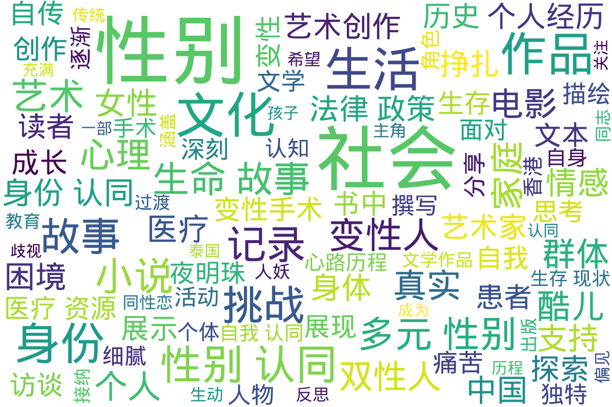

---
search:
  exclude: true
---

# 文学作品和艺术创作

!!! info

    本部分收录一切形式的跨儿文学艺术创作。无论是发布于互联网某个阴暗角落的「变性人」自传，还是形式晦涩、发人深省的诗歌电影，均可收录在本版块。，涵盖了多种形式的表达，包括小说、漫画、纪实作品、自传和诗歌等。

!!! note "📊 统计信息"

    总计内容：197 篇
    标签：`跨性别` `文学作品` `艺术创作` `自传` `小说` `漫画` `纪实作品` `诗歌`

## 📁 子目录

<table>
<thead><tr>
<th style="width: 30%" data-sortable="true" data-sort-direction="asc" data-sort-type="text">目录名 ▲</th>
<th style="width: 20%" data-sortable="true" data-sort-direction="asc" data-sort-type="text">文件数量 ▲</th>
<th style="width: 50%">简介</th>
</tr></thead>
<tbody>
<tr data-name="其他" data-count="8" data-date="0000-00-00">
                <td><a href="其他" class="md-button">其他</a></td>
                <td class="count-cell">8 篇</td>
                <td class="description-cell">

                    
展开

                    

                        该目录收录了一系列与多元性别相关的文学作品和艺术创作，旨在展现酷儿文化和跨性别议题在当代艺术中的重要性。目录中的作品涵盖了多个方面，包括2024年威尼斯双年展上素人艺术家的展评，此展评关注了未经主流认可的艺术创作，探索了身份和表现的多重性。吴曾的《镜头切开身份》作品也在其中，深入剖析了艺术创作如何与酷儿文化交织，提出了对身份认同和表达的反思。报告涉及的巴特勒作品集则引发对性别和权力关系的深刻探讨，鼓励观众在艺术中寻找自我认知。海伦·马尔滕与亚力汉德罗·西塞科的作品，通过艺术介入的方式揭示了社会问题的复杂性，展示了艺术在推动社会变革中的力量。总之，该目录不仅仅是艺术作品的合集，也是对多元性别现象的深刻洞察与探索。
                         文件数量：8 篇
                    

                
</td>
            </tr>
<tr data-name="图像" data-count="1" data-date="0000-00-00">
                <td><a href="图像" class="md-button">图像</a></td>
                <td class="count-cell">1 篇</td>
                <td class="description-cell">

                    
展开

                    

                        该目录收录了与跨性别主题相关的摄影、绘画等图片作品。
                         文件数量：1 篇
                    

                
</td>
            </tr>
<tr data-name="小说" data-count="100" data-date="0000-00-00">
                <td><a href="小说" class="md-button">小说</a></td>
                <td class="count-cell">100 篇</td>
                <td class="description-cell">

                    
展开

                    

                        本目录收录与跨性别相关的小说作品，涵盖了跨性别者的生活经历、情感纠葛及自我认同等主题。作品通过文学的方式，表达了跨性别者的独特声音与故事，旨在提高社会对这一群体的理解与关注。注：本目录收录的文档仅为部分小说以及评论，更多请访问 性转小说档案 <https://novel.transchinese.org/>、 <https://xnovel.transchinese.org/> 和 <https://unovel.transchinese.org/> 获取。
                         文件数量：100 篇
                    

                
</td>
            </tr>
<tr data-name="纪实作品" data-count="25" data-date="0000-00-00">
                <td><a href="纪实作品" class="md-button">纪实作品</a></td>
                <td class="count-cell">25 篇</td>
                <td class="description-cell">

                    
展开

                    

                        该目录收录与跨性别相关的纪实作品，展现跨性别者的真实生活与经历。这些作品不仅反映了个人故事，还呈现了对于社会现象的深刻洞察，包括对身份认同、过渡过程及社会接受度等话题的探索。
                         文件数量：25 篇
                    

                
</td>
            </tr>
<tr data-name="自传" data-count="55" data-date="0000-00-00">
                <td><a href="自传" class="md-button">自传</a></td>
                <td class="count-cell">55 篇</td>
                <td class="description-cell">

                    
展开

                    

                        该目录收录与跨性别相关的自传性文学作品，展示跨性别者的生命故事与过渡经历。自传不仅反映个人的成长与探索，还记录了在社会环境中的真实挑战与心路历程，具有重要的文学价值和社会意义。
                         文件数量：55 篇
                    

                
</td>
            </tr>
<tr data-name="诗歌" data-count="3" data-date="0000-00-00">
                <td><a href="诗歌" class="md-button">诗歌</a></td>
                <td class="count-cell">3 篇</td>
                <td class="description-cell">

                    
展开

                    

                        本目录收录与跨性别主题相关的诗歌作品，旨在通过文学的方式表达跨性别人群的内心世界与情感历程。这些作品反映了跨性别个体在社会、文化背景下的经历和感受，展示了多样的艺术表现形式。
                         文件数量：3 篇
                    

                
</td>
            </tr>
<tr data-name="音频影像" data-count="5" data-date="0000-00-00">
                <td><a href="音频影像" class="md-button">音频影像</a></td>
                <td class="count-cell">5 篇</td>
                <td class="description-cell">

                    
展开

                    

                        本目录收录了与跨性别相关的音频影像作品，包括艺术中心与国际美术馆合作的项目。这些作品展示了跨性别艺术家的创作，反映了其独特的视角和经历。
                         文件数量：5 篇
                    

                
</td>
            </tr>
</tbody>
</table>

## 📊 词云图 { data-search-exclude }

 

=== "最近更新"

    * 2026-01-14 [性别平等在数智元宇宙中的再塑与突破：数字身份、算法偏见与沉浸式赋权路径研究](../学术文献/人文社科/性别平等在数智元宇宙中的再塑与突破：数字身份、算法偏见与沉浸式赋权路径研究_page)
    * 2026-01-14 [跨性別公務人員之職場處境與政策措施](../学术文献/人文社科/跨性別公務人員之職場處境與政策措施_page)
    * 2026-01-14 [39例性别重置术后法医临床性别鉴定案例分析](../学术文献/医学/39例性别重置术后法医临床性别鉴定案例分析_page)
    * 2026-01-14 [2024_SFEDP专家共识：跨性别青少年的内分泌管理](../学术文献/医学/2024_SFEDP专家共识：跨性别青少年的内分泌管理_page)
    * 2026-01-14 [2025_ISPN声明：_跨性别者和性别多样化青少年的心理健康护理](../学术文献/医学/2025_ISPN声明：_跨性别者和性别多样化青少年的心理健康护理_page)
    * 2026-01-14 [变性现象](../学术文献/医学/变性现象_page)
    * 2026-01-14 [性别不一致者的内分泌管理](../学术文献/医学/性别不一致者的内分泌管理_page)
    * 2026-01-14 [蓝调石墙T](小说/蓝调石墙T_page)
    * 2025-08-07 [高齡與性別—多元性別高齡照護與政策建議](../学术文献/人文社科/高齡與性別—多元性別高齡照護與政策建議_page)
    * 2025-08-07 [激素药物网络禁售后跨性别女性生活困境与照护需求的质性研究](../学术文献/医学/激素药物网络禁售后跨性别女性生活困境与照护需求的质性研究_page)

!!! note "自动生成说明"
    目录及摘要为自动生成，仅供索引和参考，请修改 .github/ 目录下的对应脚本、模板或对应文件以更正。
