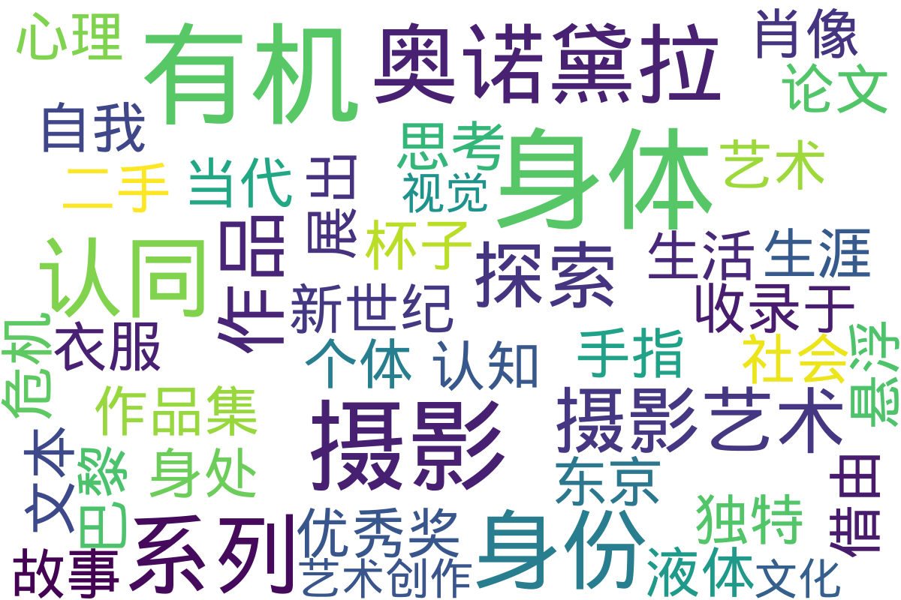

---
search:
  exclude: true
---

# 图片

!!! info

    该目录收录了与跨性别主题相关的摄影、绘画等图片作品。

!!! note "📊 统计信息"

    总计内容：1 篇
    标签：`跨性别` `艺术` `图片` `创作` `身份表达`

### 📄 文档

<table>
<thead><tr>
<th style="width: 40%" data-sortable="true" data-sort-direction="asc" data-sort-type="text">标题 ▲</th>
<th style="width: 15%" data-sortable="true" data-sort-direction="desc" data-sort-type="year">年份 ▼</th>
<th style="width: 45%">摘要</th>
</tr></thead>
<tbody>
<tr data-name="PDF_有机奥诺黛拉" data-year="2014" data-date="2024-11-07 20:08:35">
                <td><a href="PDF_有机奥诺黛拉_page" class="md-button">PDF_有机奥诺黛拉</a></td>
                <td class="year-cell">2014</td>
                <td class="description-cell">

                    
展开

                    

                        此文件为有机·奥诺黛拉的摄影作品集及其相关论文，收录于‘11根手指’系列的第24期，主要探讨有机·奥诺黛拉的摄影艺术，尤其是她对身体性和身份认同的深入思考。文中详细介绍了有机的艺术生涯，尤其是其在1991年获得摄影新世纪优秀奖后，如何借由独特的表现方式探索摄影、认知和身体性的关系。文本提到有机如何通过摄影呈现身处其心理状态的身体，以及对自我身体意识的探索。作品集中包含她在巴黎和东京展出的多个系列作品，包括《液体与杯子》、《二手衣服的肖像》和《鸟》等，并分析了这些系列如何反映出个体在当代社会中的悬浮及身份认同危机。
                         年份：2014
                         收录日期：2024-11-07 20:08:35
                    

                
</td>
            </tr>
</tbody>
</table>

## 📊 词云图 { data-search-exclude }

 

=== "最近更新"

    * 9999-12-31 [跨性别心理咨询的理论与实践研究_吕娜](../../学术文献/人文社科/跨性别心理咨询的理论与实践研究_吕娜.caj)
    * 2025-05-30 [不同立場定位之跨性別女性語言風格_言談及聲調分析](../../学术文献/人文社科/不同立場定位之跨性別女性語言風格_言談及聲調分析_page)
    * 2025-05-30 [創傷孤島：臺灣跨性別者面臨之歧視、隱微歧視、創傷與韌性](../../学术文献/人文社科/創傷孤島：臺灣跨性別者面臨之歧視、隱微歧視、創傷與韌性_page)
    * 2025-03-11 [2021_孟嘉杰_性别研究遭遇华语语系之后_书评](../../学术文献/人文社科/2021_孟嘉杰_性别研究遭遇华语语系之后_书评_page)
    * 2025-03-11 [德國跨性別人權與婚姻自由的法律分析_陳宜倩_2008](../../学术文献/人文社科/德國跨性別人權與婚姻自由的法律分析_陳宜倩_2008_page)
    * 2025-03-11 [性別越界在1950年代的華語語系臺灣_姜學豪](../../学术文献/人文社科/性別越界在1950年代的華語語系臺灣_姜學豪_page)
    * 2025-03-05 [关于亚文化“伪娘现象”的表征浅谈](../../学术文献/人文社科/关于亚文化“伪娘现象”的表征浅谈_page)
    * 2025-03-05 [被排除在外的生命：本港最大型有關處於社會及法律邊緣的跨性別人士研究](../../学术文献/人文社科/被排除在外的生命：本港最大型有關處於社會及法律邊緣的跨性別人士研究_page)
    * 2025-02-27 [2016年04月_跨性別者現身前後與家人互動之變化歷程](../../学术文献/人文社科/2016年04月_跨性別者現身前後與家人互動之變化歷程_page)
    * 2025-02-27 [「性／別壓迫」：跨性別主體在台灣](../../学术文献/人文社科/「性／別壓迫」：跨性別主體在台灣_page)

!!! note "自动生成说明"
    目录及摘要为自动生成，仅供索引和参考，请修改 .github/ 目录下的对应脚本、模板或对应文件以更正。
