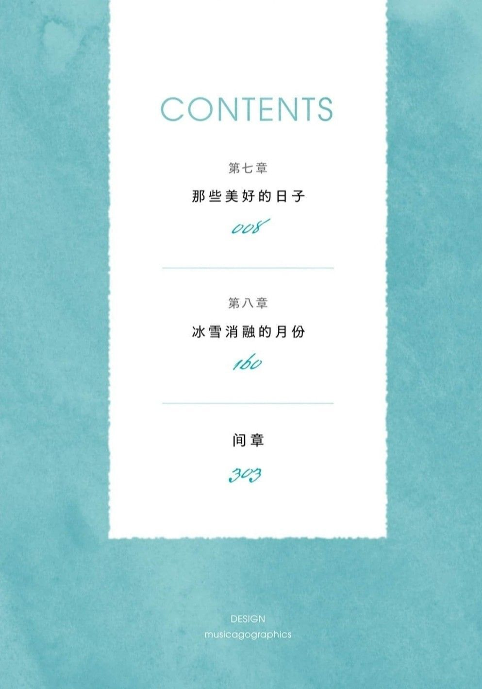

---
search:
  exclude: true
---

# 第四卷

!!! info

    本目录收录了《银荆的告白》第四卷的插画作品，展示了跨性别主题下的文学艺术创作，体现了跨性别群体的情感与身份探索。

!!! note "📊 统计信息"

    总计内容：15 篇
    标签：`跨性别` `文学` `艺术` `插画` `银荆的告白` `小说` `情感表达`

### 🖼️ 图片

<table>
<thead><tr>
<th style="width: 40%" data-sortable="true" data-sort-direction="asc" data-sort-type="text">标题 ▲</th>
<th style="width: 15%" data-sortable="true" data-sort-direction="desc" data-sort-type="year">年份 ▼</th>
<th style="width: 45%">摘要</th>
</tr></thead>
<tbody>
<tr class="image-row">
                <td colspan="3">
                    

                        
                        
Image_1720746000128

                    

                </td>
            </tr>
<tr class="image-row">
                <td colspan="3">
                    

                        
                        
Image_1720746001839

                    

                </td>
            </tr>
<tr class="image-row">
                <td colspan="3">
                    

                        
                        
Image_1720746003376

                    

                </td>
            </tr>
<tr class="image-row">
                <td colspan="3">
                    

                        
                        
Image_1720746004963

                    

                </td>
            </tr>
<tr class="image-row">
                <td colspan="3">
                    

                        
                        
Image_1720746006438

                    

                </td>
            </tr>
<tr class="image-row">
                <td colspan="3">
                    

                        
                        
Image_1720746007940

                    

                </td>
            </tr>
<tr class="image-row">
                <td colspan="3">
                    

                        
                        
Image_1720746009387

                    

                </td>
            </tr>
<tr class="image-row">
                <td colspan="3">
                    

                        
                        
Image_1720746010860

                    

                </td>
            </tr>
<tr class="image-row">
                <td colspan="3">
                    

                        
                        
Image_1720746012266

                    

                </td>
            </tr>
<tr class="image-row">
                <td colspan="3">
                    

                        
                        
Image_1720746013737

                    

                </td>
            </tr>
<tr class="image-row">
                <td colspan="3">
                    

                        
                        
Image_1720746015243

                    

                </td>
            </tr>
<tr class="image-row">
                <td colspan="3">
                    

                        
                        
Image_1720746016463

                    

                </td>
            </tr>
<tr class="image-row">
                <td colspan="3">
                    

                        
                        
Image_1720746017775

                    

                </td>
            </tr>
<tr class="image-row">
                <td colspan="3">
                    

                        
                        
Image_1720746019357

                    

                </td>
            </tr>
<tr class="image-row">
                <td colspan="3">
                    

                        
                        
Image_1720746048965

                    

                </td>
            </tr>
</tbody>
</table>

 

=== "最近更新"

    * 2025-08-07 [高齡與性別—多元性別高齡照護與政策建議](../../../../../学术文献/人文社科/高齡與性別—多元性別高齡照護與政策建議_page)
    * 2025-08-07 [激素药物网络禁售后跨性别女性生活困境与照护需求的质性研究](../../../../../学术文献/医学/激素药物网络禁售后跨性别女性生活困境与照护需求的质性研究_page)
    * 2025-08-07 [跨性别态度与信念量表中文版测评成年人的效度和信度](../../../../../学术文献/医学/跨性别态度与信念量表中文版测评成年人的效度和信度_page)
    * 2025-05-30 [不同立場定位之跨性別女性語言風格_言談及聲調分析](../../../../../学术文献/人文社科/不同立場定位之跨性別女性語言風格_言談及聲調分析_page)
    * 2025-05-30 [創傷孤島：臺灣跨性別者面臨之歧視、隱微歧視、創傷與韌性](../../../../../学术文献/人文社科/創傷孤島：臺灣跨性別者面臨之歧視、隱微歧視、創傷與韌性_page)
    * 2025-03-11 [2021_孟嘉杰_性别研究遭遇华语语系之后_书评](../../../../../学术文献/人文社科/2021_孟嘉杰_性别研究遭遇华语语系之后_书评_page)
    * 2025-03-11 [德國跨性別人權與婚姻自由的法律分析_陳宜倩_2008](../../../../../学术文献/人文社科/德國跨性別人權與婚姻自由的法律分析_陳宜倩_2008_page)
    * 2025-03-11 [性別越界在1950年代的華語語系臺灣_姜學豪](../../../../../学术文献/人文社科/性別越界在1950年代的華語語系臺灣_姜學豪_page)
    * 2025-03-05 [关于亚文化“伪娘现象”的表征浅谈](../../../../../学术文献/人文社科/关于亚文化“伪娘现象”的表征浅谈_page)
    * 2025-03-05 [被排除在外的生命：本港最大型有關處於社會及法律邊緣的跨性別人士研究](../../../../../学术文献/人文社科/被排除在外的生命：本港最大型有關處於社會及法律邊緣的跨性別人士研究_page)

!!! note "自动生成说明"
    目录及摘要为自动生成，仅供索引和参考，请修改 .github/ 目录下的对应脚本、模板或对应文件以更正。
