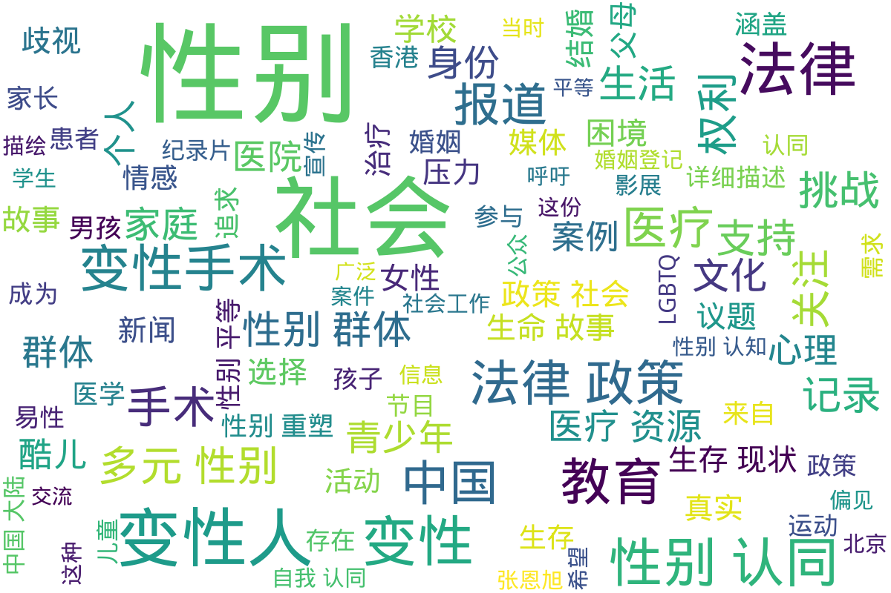

---
search:
  exclude: true
---

# 杂志及新闻报道

!!! info

    本目录包含关于中国大陆、海外及港澳台地区的跨性别相关杂志与新闻报道，二级分类按照发布的报纸杂志所在地区区分。旨在汇集各地对跨性别话题的不同视角与声音，提供相关信息和资源。此处主要收集传统媒体以及 PDF 文档或图片形式的新闻报道，例如杂志、剪报等。网页新闻报道请访问 <https://news.transchinese.org>，包含数千个相关网页。

!!! note "📊 统计信息"

    总计内容：62 篇
    标签：`跨性别` `杂志` `新闻报道` `生命故事` `社会环境`

## 📁 子目录

<table>
<thead><tr>
<th style="width: 30%" data-sortable="true" data-sort-direction="asc" data-sort-type="text">目录名 ▲</th>
<th style="width: 20%" data-sortable="true" data-sort-direction="asc" data-sort-type="text">文件数量 ▲</th>
<th style="width: 50%">简介</th>
</tr></thead>
<tbody>
<tr data-name="中国大陆" data-count="43" data-date="0000-00-00">
                <td><a href="中国大陆" class="md-button">中国大陆</a></td>
                <td class="count-cell">43 篇</td>
                <td class="description-cell">

                    
展开

                    

                        这一目录收录了来自中国大陆的杂志和新闻报道，涵盖了跨性别群体的各种生活与社会现象，提供了真实的视角和声音，展示了跨性别者在社会中所面临的挑战与成就。
                         文件数量：43 篇
                    

                
</td>
            </tr>
<tr data-name="海外" data-count="6" data-date="0000-00-00">
                <td><a href="海外" class="md-button">海外</a></td>
                <td class="count-cell">6 篇</td>
                <td class="description-cell">

                    
展开

                    

                        此目录包含与跨性别相关的国际杂志和新闻报道，旨在分享海外跨性别群体的生活、挑战和成就。这些报道和文章提供了宝贵的视角，加深公众对跨性别议题的理解，促进社会包容。
                         文件数量：6 篇
                    

                
</td>
            </tr>
<tr data-name="港澳台" data-count="13" data-date="0000-00-00">
                <td><a href="港澳台" class="md-button">港澳台</a></td>
                <td class="count-cell">13 篇</td>
                <td class="description-cell">

                    
展开

                    

                        本目录收录与港澳台地区相关的跨性别报道与杂志内容，包括对跨性别者的生活、法律、医疗等多方面的报道，旨在宣传和提高社会对跨性别问题的认知与理解。
                         文件数量：13 篇
                    

                
</td>
            </tr>
</tbody>
</table>

## 📊 词云图 { data-search-exclude }

 

=== "最近更新"

    * 2026-01-14 [性别平等在数智元宇宙中的再塑与突破：数字身份、算法偏见与沉浸式赋权路径研究](../学术文献/人文社科/性别平等在数智元宇宙中的再塑与突破：数字身份、算法偏见与沉浸式赋权路径研究_page)
    * 2026-01-14 [竞技公平与性别包容的张力与调和—论国际体育赛事性别检测的历史嬗变、当代困境及未来趋势](../学术文献/人文社科/竞技公平与性别包容的张力与调和—论国际体育赛事性别检测的历史嬗变、当代困境及未来趋势_page)
    * 2026-01-14 [跨性別公務人員之職場處境與政策措施](../学术文献/人文社科/跨性別公務人員之職場處境與政策措施_page)
    * 2026-01-14 [39例性别重置术后法医临床性别鉴定案例分析](../学术文献/医学/39例性别重置术后法医临床性别鉴定案例分析_page)
    * 2026-01-14 [2024_SFEDP专家共识：跨性别青少年的内分泌管理](../学术文献/医学/2024_SFEDP专家共识：跨性别青少年的内分泌管理_page)
    * 2026-01-14 [2025_ISPN声明：_跨性别者和性别多样化青少年的心理健康护理](../学术文献/医学/2025_ISPN声明：_跨性别者和性别多样化青少年的心理健康护理_page)
    * 2026-01-14 [变性现象](../学术文献/医学/变性现象_page)
    * 2026-01-14 [性别不一致者的内分泌管理](../学术文献/医学/性别不一致者的内分泌管理_page)
    * 2026-01-14 [行政院「性別變更要件法制化及立法建議」研究案](../政府及官方组织文件/港澳台/行政院「性別變更要件法制化及立法建議」研究案_page)
    * 2026-01-14 [蓝调石墙T](../文学作品和艺术创作/小说/蓝调石墙T_page)

!!! note "自动生成说明"
    目录及摘要为自动生成，仅供索引和参考，请修改 .github/ 目录下的对应脚本、模板或对应文件以更正。
