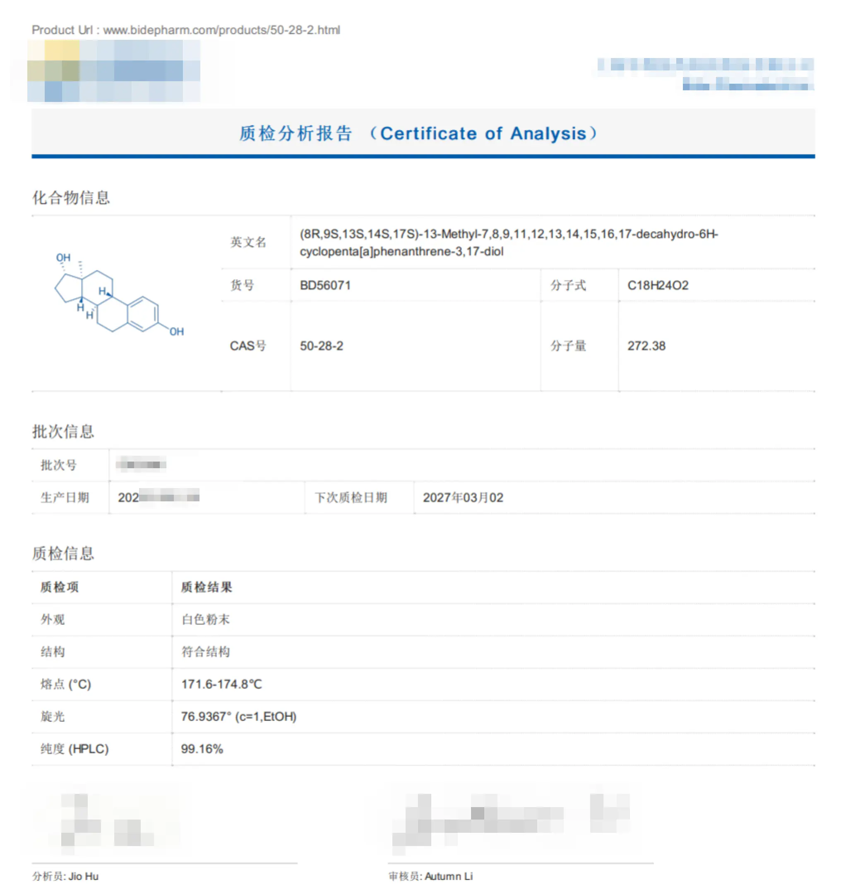
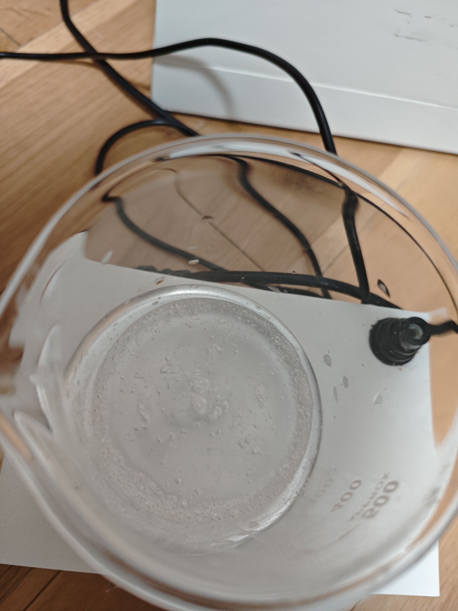

---
search:
  exclude: true
---

# 雌二醇凝胶自制方法

!!! info

    本目录提供了雌二醇凝胶的自制方法，帮助跨性别者获取激素治疗的知识与资源，促进自我过渡。

!!! note "📊 统计信息"

    总计内容：4 篇
    标签：`激素治疗` `跨性别护理` `自制药物` `雌二醇凝胶` `健康资源`

### 🖼️ 图片

<table>
<thead><tr>
<th style="width: 40%" data-sortable="true" data-sort-direction="asc" data-sort-type="text">标题 ▲</th>
<th style="width: 15%" data-sortable="true" data-sort-direction="desc" data-sort-type="year">年份 ▼</th>
<th style="width: 45%">摘要</th>
</tr></thead>
<tbody>
<tr class="image-row">
                <td colspan="3">
                    

                        
                        
COA

                    

                </td>
            </tr>
<tr class="image-row">
                <td colspan="3">
                    

                        
                        
溶解完成

                    

                </td>
            </tr>
<tr class="image-row">
                <td colspan="3">
                    

                        
                        
溶解完成带灯光

                    

                </td>
            </tr>
</tbody>
</table>

### 🌐 网页

<table>
<thead><tr>
<th style="width: 40%" data-sortable="true" data-sort-direction="asc" data-sort-type="text">标题 ▲</th>
<th style="width: 15%" data-sortable="true" data-sort-direction="desc" data-sort-type="year">年份 ▼</th>
<th style="width: 45%">摘要</th>
</tr></thead>
<tbody>
<tr data-name="雌二醇凝胶自制方法" data-year="None" data-date="2024-12-13 05:32:01">
                <td><a href="雌二醇凝胶自制方法" class="md-button">雌二醇凝胶自制方法</a></td>
                <td class="year-cell">None</td>
                <td class="description-cell">无摘要</td>
            </tr>
</tbody>
</table>

 

=== "最近更新"

    * 2026-01-14 [性别平等在数智元宇宙中的再塑与突破：数字身份、算法偏见与沉浸式赋权路径研究](../../../学术文献/人文社科/性别平等在数智元宇宙中的再塑与突破：数字身份、算法偏见与沉浸式赋权路径研究_page)
    * 2026-01-14 [竞技公平与性别包容的张力与调和—论国际体育赛事性别检测的历史嬗变、当代困境及未来趋势](../../../学术文献/人文社科/竞技公平与性别包容的张力与调和—论国际体育赛事性别检测的历史嬗变、当代困境及未来趋势_page)
    * 2026-01-14 [跨性別公務人員之職場處境與政策措施](../../../学术文献/人文社科/跨性別公務人員之職場處境與政策措施_page)
    * 2026-01-14 [39例性别重置术后法医临床性别鉴定案例分析](../../../学术文献/医学/39例性别重置术后法医临床性别鉴定案例分析_page)
    * 2026-01-14 [2024_SFEDP专家共识：跨性别青少年的内分泌管理](../../../学术文献/医学/2024_SFEDP专家共识：跨性别青少年的内分泌管理_page)
    * 2026-01-14 [2025_ISPN声明：_跨性别者和性别多样化青少年的心理健康护理](../../../学术文献/医学/2025_ISPN声明：_跨性别者和性别多样化青少年的心理健康护理_page)
    * 2026-01-14 [变性现象](../../../学术文献/医学/变性现象_page)
    * 2026-01-14 [性别不一致者的内分泌管理](../../../学术文献/医学/性别不一致者的内分泌管理_page)
    * 2026-01-14 [行政院「性別變更要件法制化及立法建議」研究案](../../../政府及官方组织文件/港澳台/行政院「性別變更要件法制化及立法建議」研究案_page)
    * 2026-01-14 [蓝调石墙T](../../../文学作品和艺术创作/小说/蓝调石墙T_page)

!!! note "自动生成说明"
    目录及摘要为自动生成，仅供索引和参考，请修改 .github/ 目录下的对应脚本、模板或对应文件以更正。
