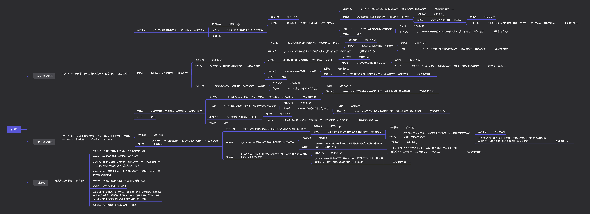
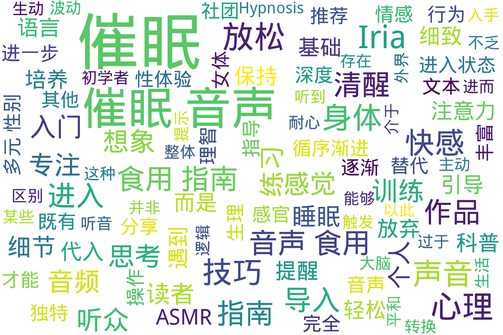

---
search:
  exclude: true
---

# 催眠

!!! info

    该目录收录了多篇与催眠音声体验相关的详细文档，主要涉及跨性别和多元性别群体在生活与性体验领域中的实践和探索。从入门指南到基础篇、小技巧篇，再到催眠科普和进阶图，文档内容涵盖了催眠音声的使用方法、技巧、注意事项及心理和生理反应的观察。文档中既有作者以第一人称分享亲身体验的个人体悟，也有对催眠状态从放松、入门、深入到维持催眠体验整个过程的系统阐述。文件详细讨论了如何通过声音引导进入催眠状态，分析了常见问题与对策，如如何避免分心、如何调整呼吸和如何利用环境提示来增强体验效果。此外，还涉及了催眠状态下的独特生理反应描述，如身体各部位的感觉变化、快感体验以及心理状态的转移。整体上，这些文档体现了对催眠音声这一艺术与科学交融的体验方式的深入研究，既适用于初学者，也为有一定经验的听众提供了丰富的理论指导和实际操作建议。文中多次引用具体作品和实例，如VOICE LOVER社团、ディーブルスト社团的相关音声案例，旨在为读者绘制一幅全方位的催眠体验图景，并探索其在多元性别和跨性别群体中的应用与意义。

!!! note "📊 统计信息"

    总计内容：5 篇
    标签：`催眠音声` `体验指南` `多元性别` `跨性别` `性体验` `心理调适` `身体反应` `科普` `实践操作` `声音引导`

### 📄 文档

<table>
<thead><tr>
<th style="width: 40%" data-sortable="true" data-sort-direction="asc" data-sort-type="text">标题 ▲</th>
<th style="width: 15%" data-sortable="true" data-sort-direction="desc" data-sort-type="year">年份 ▼</th>
<th style="width: 45%">摘要</th>
</tr></thead>
<tbody>
<tr data-name="Iria的催眠音声食用指南：入门篇" data-year="None" data-date="2025-03-05">
                <td><a href="Iria的催眠音声食用指南：入门篇_page" class="md-button">Iria的催眠音声食用指南：入门篇</a></td>
                <td class="year-cell">None</td>
                <td class="description-cell">

                    
展开

                    

                        本文件为一篇详细的催眠音声使用指南，标题为《Iria的催眠音声食用指南：入门篇》，作者以第一人称的口吻分享了自身对催眠音声体验过程的认识和体验。文中以一种轻松诙谐的语气展开讨论，着重介绍了催眠音声的听法、入门技巧以及可能遇到的问题与解决方案。文章首先指出很多网上的催眠攻略大多属于指示型，主要告诉听众如何操作才能进入状态，缺乏对原因和注意事项的详细解释。作者强调，催眠不仅仅依靠技巧，而是在放松心态，排除杂念、专注于声音引导的过程中自然产生的体验。文章中用“听”这一简单的字眼，作为如何进入催眠状态的总结，并以类比看电影的方式，建议听众应将催眠音声视作一场声音的故事，放下主观意识，让自己被声音缓缓引导进入状态。文中详细讨论了入门时听众常常会遇到的问题：如长时间无法进入状态、听了催眠音声却感觉不到效果，以及因为过多的想象或者过分关注细节而导致分心的问题。作者从个人经验出发，提出了循序渐进培养听觉感受的方法，建议新手先从其他ASMR音声入手，逐步培养对声音的敏感度，最终达到可以顺利进入催眠状态的目的。文章中用大量实例和作品推荐来辅助说明，如VOICE LOVER社团的『ささやき庵』系列、ディーブルスト社团的作品以及其他社团的典型作品，细致讨论了不同类型导入、强化语音指示、音效安排等细节。作者还描述了三种常见的催眠导入方式：独立导入、自然导入和综合导入，并详细说明了各自的优缺点和适用场景，帮助听众判断何种方式更适合自己的催眠体验。文本中引用了诸多细节描述，例如关于台本制作上的优劣、20-40分钟的导入部分要求以及音效不能过于突兀等细节，无不给人以启发。此外，文件还涉及到如何避免在催眠过程中做出不必要的多余行为，并通过类比学习如何提高对声音信息的接受与感知。作者不仅从理论上解释催眠音声的原理，还结合丰富的实践案例，剖析了心理状态、体力和注意力对催眠体验的影响，指出即使选择了合适的作品，个人对音声的不感兴趣也会影响体验效果。文件内容深入浅出，既有专业的技术分析，也不乏轻松幽默的语言风格，为初学者和有一定经验的听众提供了一个极具参考价值的入门指南。通过对各种催眠音声作品的推荐和详细解说，文本描绘出了一幅全面的催眠音声体验画卷，为读者提供了具体而实用的操作建议，体现了作者对声音诱导艺术的理解与热爱。
                         年份：None
                         收录日期：2025-03-05
                    

                
</td>
            </tr>
<tr data-name="Iria的催眠音声食用指南：基础篇" data-year="None" data-date="2025-03-05">
                <td><a href="Iria的催眠音声食用指南：基础篇_page" class="md-button">Iria的催眠音声食用指南：基础篇</a></td>
                <td class="year-cell">None</td>
                <td class="description-cell">

                    
展开

                    

                        本文档为《Iria的催眠音声食用指南：基础篇》的详细内容，集中探讨如何稳定而迅速地通过催眠音声进入催眠状态，并进一步保持催眠深度达到极致快感体验。文中首先介绍了入门指导时强调的三项基本原则，即找对作品、用耳朵听、以及循序渐进地培养催眠状态和快感，着重说明催眠音声并非传统意义上的安眠音声，而更多强调精神上和身体上的体验。作者Iria以亲身体验为基础，细致描绘了催眠过程中从放松状态到深度沉浸、从意识暂时放空到感受到身体各部位快感的复杂过程，力图打破传统催眠理论，以体验为主导，强调任何人在尝试催眠前应充分放松，避免因用力思考而干扰体验。

文中详细讨论了如何通过“放松听”、“静心听”和“注意力放在音声上”这三大主线指导体验，结合实际操作方法，为听者提供了操作性的建议，例如催眠状态中的身体反应、呼吸节奏、以及内在情感波动等生理和心理特征。Iria在文中引用了自己和其他体验者在催眠过程中的感受，例如“腰部发软、身体各部位微微发麻”、“呼吸急促乃至心脏扑通扑通”，并通过某些细腻的描述突显了女体催眠带来的特殊快感体验，甚至涉及了极具争议和颠覆传统认知的感官体验，如从“感觉到G点/小豆豆/子宫的存在”到“被射入子宫的感觉”。

文本进一步阐述了催眠状态下的心境转移，提醒听者注意将注意力放在音声上，而不是去不断地思考如何放松或如何专注，强调一种‘忘掉指南’式的状态，可以更容易达到催眠深度。文中还列举了催眠前可以做的一些准备和不宜做的行为，如淋浴、拉伸等能提升状态的行为，以及避免饱腹、酒精等负面干扰因素，并用直白的语言表达了这些体验只有在实际经历之后才能完全理解。作者提醒说，催眠音声虽然能够实现近似梦境的沉浸体验，但并不应幻想其可以控制大脑，而是应被视为一种能带来精神和身体愉悦的独特疗法。

此外，指南还将内容分为多个阶段进行阐释，从导入阶段的放松和深化，到中间阶段的印象建立以及最终的解除过程，每一个阶段都附带有详尽的操作提示和心理引导。作者在文中以‘地图’的比喻说明如何选择自己最需要的部分进行阅读，并且警示那些已经习惯特定听催眠方式的用户，要谨慎对待指南中的信息以免干扰已有的体验习惯。整个文档内容丰富，风格直白而生动，既有对生理反应的细致描述，也有对心理状态变化的理论分析，是一个将催眠体验艺术与科学方法相互交融的综合指南。
                         年份：None
                         收录日期：2025-03-05
                    

                
</td>
            </tr>
<tr data-name="Iria的催眠音声食用指南：小技巧篇" data-year="None" data-date="2025-03-05">
                <td><a href="Iria的催眠音声食用指南：小技巧篇_page" class="md-button">Iria的催眠音声食用指南：小技巧篇</a></td>
                <td class="year-cell">None</td>
                <td class="description-cell">

                    
展开

                    

                        该文档为一个名为《Iria的催眠音声食用指南：小技巧篇》的个人经验分享文档，主要讲述作者在听催眠音声过程中的体验及一系列可以增强代入感的小技巧。文档开头，作者以“大家好，我是Iria”自我介绍，提到自己名字的由来与游戏时随手取用的趣闻，并说明在使用音声后代入感显著提升，进而形成了独特的个人体验。文章内容细致地阐述了如何在听催眠音声时通过主观暗示来强化体验，例如通过更换网络昵称为音声中的女主角名称来营造代入感，在体验过程中暗示自己处于一种“目隐”的状态，使得视界被屏蔽，凭借听觉感知外界，从而放弃对图像的依赖。同时，作者还描述了一种“届不到”的技巧，即在面对音声中描述的身体接触（如亲吻和爱抚）时，通过想象物理接触稍稍错开边缘，以降低心理负担并促进催眠效果。文档中还特别提出了另一个思路：对于身体暖感的暗示，作者建议用想象体温上升来替代直接的视觉或触觉体验，强化内心的感受，进一步激发紧张状态中潜在的快感记忆。作者细腻地描述了如何将“痒”这一较为温和的感觉与“快感”进行联想，以达到逐步积累性快感的目的，指出“快感是很难想象，也不应刻意想象的暗示部分”，以此警示听众不要过分追求激烈刺激。文中虽以轻松调侃的语言展开，但也不忘提醒使用者注意适龄问题，明确提出不推荐18岁以下未成年人士尝试这类体验。文档整体风格轻松而具有个人色彩，是围绕催眠音声在性体验和情感代入中的技巧分享，既有具体操作的建议，也融入了作者自身对音声代入、感觉替代和身体暗示的深刻体会。从文中摘录的“将自己的各种网络昵称改成音声里的女主名”到“用想象小腹里或会阴处有些细细的，痒痒的感觉来替代快感”的描述，无不体现出一种探索自我与体验边界的态度，同时文档也为此类跨性别或多元性别群体中的声音治疗及体验提供了独到的见解。文章内容丰富详细，不仅包含了各项具体技巧，而且辅以情感宣泄和社群互动元素，显示出其作为生活与性体验记录的独特视角和实验性质。
                         年份：None
                         收录日期：2025-03-05
                    

                
</td>
            </tr>
<tr data-name="催眠小科普" data-year="None" data-date="2025-03-05">
                <td><a href="催眠小科普_page" class="md-button">催眠小科普</a></td>
                <td class="year-cell">None</td>
                <td class="description-cell">

                    
展开

                    

                        这份文件是一篇关于催眠状态和催眠练习的科普文档，内容详细地阐述了催眠（Hypnosis）的概念及其与普通睡眠之间的区别。文章指出，催眠并非单纯地促进睡眠，而是在介于完全清醒和完全睡眠之间的一种状态。作者通过对比“催眠（Hypnosis）”与“催眠（Promotes sleep）”的不同，说明了在生理和心理层面上，两者所呈现的状态虽然有相似之处，但又有本质的区别。文中描述了人体在听到外界提示时，如何从沉睡中逐渐恢复清醒，以及如何在放松中保持适度的理智。文章认为，催眠状态实际上是一种介于清醒与睡眠之间的微妙状态，这种状态在现代生活中无时无刻不在被体验，譬如早晨的闹钟唤醒或是夜晚进入梦乡的过程均可以看作是催眠状态的一部分。

文档详细探讨了催眠状态的训练与练习方法，强调了耐心、平和心态和专注力的重要性。文中提到，催眠状态的深浅程度不同，初学者需要循序渐进地从简单的触发类ASMR音频入手，进而逐渐过渡到更为复杂的音频内容。作者指出，练习催眠状态不仅需要一定的生理和心理基础，而且需要学会放弃主动的逻辑思考，才能更好地进入那种近似于睡眠但却保持部分清醒意识的状态。文章中不乏对具体听音体验的描述，比如当听到音频中的触发音或舔耳音时，大脑能够自然而然地产生对应的感受，同时也提醒读者不要因为一时的走神或意念飘散而放弃训练。

文章还深入讨论了练习催眠状态过程中可能遇到的各种心态问题，譬如理智的作用和患得患失的心理障碍。作者以朴实的语言解释道，思考往往会使我们更加清醒，而过于清醒则可能阻碍进入催眠状态，因此放弃主动思考是达到催眠状态的关键。文中引用了“音频说我们累了，我们不需要思考，我现在要假装女孩子了”等生动的例子，以此来说明在催眠过程中，潜意识的顺从比清醒理智的抵抗更为重要。这种观点不仅涵盖了催眠训练的本质，也为读者提供了一种全新的观察和体验视角。

整篇文档语言流畅，尽管存在逻辑上某些不尽完美的地方，但整体上为读者呈现了一种关于如何通过音频训练来实现状态转换的系统介绍。文章在讲解催眠状态的同时，也涉及了听音训练中可能遇到的心理波动、注意力分散以及如何通过专注和耐心来克服这些问题。作者鼓励读者在练习过程中保持平和心态，不追求一步登天，而是通过不断重复和反复体验来逐渐掌握进入深层催眠状态的方法。文件内容不仅适合作为催眠入门的科普资料，也为那些在心理调整和专注力培养方面有需要的人提供了实践指导和心灵慰藉。
                         年份：None
                         收录日期：2025-03-05
                    

                
</td>
            </tr>
</tbody>
</table>

### 🖼️ 图片

<table>
<thead><tr>
<th style="width: 40%" data-sortable="true" data-sort-direction="asc" data-sort-type="text">标题 ▲</th>
<th style="width: 15%" data-sortable="true" data-sort-direction="desc" data-sort-type="year">年份 ▼</th>
<th style="width: 45%">摘要</th>
</tr></thead>
<tbody>
<tr class="image-row">
                <td colspan="3">
                    

                        
                        
催眠音声进阶图

                    

                </td>
            </tr>
</tbody>
</table>

## 📊 词云图 { data-search-exclude }

 

=== "最近更新"

    * 2025-1-10 [嗓音训练指南](../../手册指南/嗓音训练指南_page)
    * 2025-06-20 [学历学位信息问题的一条解决路径_补充说明](../../手册指南/学历学位信息问题的一条解决路径_补充说明_page)
    * 2025-05-30 [不同立場定位之跨性別女性語言風格_言談及聲調分析](../../../学术文献/人文社科/不同立場定位之跨性別女性語言風格_言談及聲調分析_page)
    * 2025-05-30 [創傷孤島：臺灣跨性別者面臨之歧視、隱微歧視、創傷與韌性](../../../学术文献/人文社科/創傷孤島：臺灣跨性別者面臨之歧視、隱微歧視、創傷與韌性_page)
    * 2025-05-30 [Shattered_Memories_自切教程](../../手册指南/Shattered_Memories_自切教程_page)
    * 2025-04-08 [学历学位信息问题的一条解决路径](../../手册指南/学历学位信息问题的一条解决路径_page)
    * 2025-03-11 [2021_孟嘉杰_性别研究遭遇华语语系之后_书评](../../../学术文献/人文社科/2021_孟嘉杰_性别研究遭遇华语语系之后_书评_page)
    * 2025-03-11 [德國跨性別人權與婚姻自由的法律分析_陳宜倩_2008](../../../学术文献/人文社科/德國跨性別人權與婚姻自由的法律分析_陳宜倩_2008_page)
    * 2025-03-11 [性別越界在1950年代的華語語系臺灣_姜學豪](../../../学术文献/人文社科/性別越界在1950年代的華語語系臺灣_姜學豪_page)
    * 2025-03-11 [171本精品变文介绍：_变身文推荐员浮玉](../../../文学作品和艺术创作/小说/171本精品变文介绍：_变身文推荐员浮玉_page)

!!! note "自动生成说明"
    目录及摘要为自动生成，仅供索引和参考，请修改 .github/ 目录下的对应脚本、模板或对应文件以更正。
