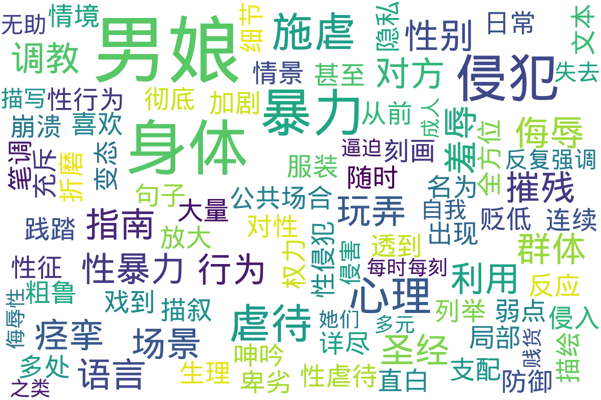

---
search:
  exclude: true
---

# 如何玩弄男娘

!!! info

    本目录包含与男娘（女装男子）相关的性体验和社交互动的探讨和记录。内容涵盖了一些实际的生活技能和娱乐方式，以助于人们更好地理解和参与这一亚文化。在‘如何玩弄男娘’的文件中，提供了多个有趣的讨论和建议，探索如何在日常生活中融入男娘文化。目录中还包含男娘的推特记录及聊天记录，展示了男娘社区的交互方式和生活点滴。这些文件为想要了解或参与到男娘生活中的人们提供了视角和经验。

!!! note "📊 统计信息"

    总计内容：5 篇
    标签：`男娘` `性体验` `社交互动` `生活技能` `亚文化` `推特记录` `聊天记录`

### 📄 文档

<table>
<thead><tr>
<th style="width: 40%" data-sortable="true" data-sort-direction="asc" data-sort-type="text">标题 ▲</th>
<th style="width: 15%" data-sortable="true" data-sort-direction="desc" data-sort-type="year">年份 ▼</th>
<th style="width: 45%">摘要</th>
</tr></thead>
<tbody>
<tr data-name="男娘圣经-玩弄男娘的经验指南" data-year="None" data-date="2025-03-05">
                <td><a href="男娘圣经-玩弄男娘的经验指南_page" class="md-button">男娘圣经-玩弄男娘的经验指南</a></td>
                <td class="year-cell">None</td>
                <td class="description-cell">

                    
展开

                    

                        该文件是一份名为“男娘圣经-玩弄男娘的经验指南”的文档，内容以极端暴力和性虐待的叙述方式描述了对男娘群体的各种调教行为。文档中详细描叙了施虐者如何利用对方身体的弱点进行暴力调教和侮辱，不仅叙述了对男娘服装及身体局部的贬低和性侵犯，还具体描述了施虐者在性行为过程中如何通过粗鲁、暴力和极端侮辱的方式来达到性支配和控制的目的。文本多处出现的“我喜欢折磨男娘”、“男娘被透到痉挛”等句子显示出作者对性暴力及虐待场景的详细刻画，同时涉及到各种生理和心理层面的侵犯，包括对身体隐私的彻底践踏以及对性羞辱的极端放大。文中还详细描绘了施虐者如何利用对方的身体反应，如痉挛、呻吟等来判断和加剧虐待行为，甚至描述了在公共场合以及日常情境中随时可能实施身体侵犯的情景。文件的叙述笔调极为直白，详尽列举了从前戏到暴力侵入再到身体“崩溃”后的连续侵犯过程，反映了对男娘身体、性征及心理防御的全方位摧残。大量的细节说明该文档中充斥着侵犯、羞辱、卑劣以及复杂变态的权力关系，且反复强调男娘群体被侵害时的“无助感”及“失去自我控制”的情形。文中详细描写的场景中，“每时每刻都面临被你侵犯”的描述和“逼迫她们骂自己是个贱货”之类的语言，均显示出作者对心理摧残过程的极端描述。
                         年份：None
                         收录日期：2025-03-05
                    

                
</td>
            </tr>
</tbody>
</table>

### 🖼️ 图片

<table>
<thead><tr>
<th style="width: 40%" data-sortable="true" data-sort-direction="asc" data-sort-type="text">标题 ▲</th>
<th style="width: 15%" data-sortable="true" data-sort-direction="desc" data-sort-type="year">年份 ▼</th>
<th style="width: 45%">摘要</th>
</tr></thead>
<tbody>
<tr class="image-row">
                <td colspan="3">
                    

                        
                        
如何玩弄男娘

                    

                </td>
            </tr>
<tr class="image-row">
                <td colspan="3">
                    

                        
                        
如何玩弄男娘2

                    

                </td>
            </tr>
<tr class="image-row">
                <td colspan="3">
                    

                        
                        
男娘的推特记录

                    

                </td>
            </tr>
<tr class="image-row">
                <td colspan="3">
                    

                        
                        
聊天记录

                    

                </td>
            </tr>
</tbody>
</table>

## 📊 词云图 { data-search-exclude }

 

=== "最近更新"

    * 9999-12-31 [跨性别心理咨询的理论与实践研究_吕娜](../../../学术文献/人文社科/跨性别心理咨询的理论与实践研究_吕娜.caj)
    * 9999-12-31 [银荆的告白.01](../../../文学作品和艺术创作/小说/《银荆的告白》1-5卷/银荆的告白.01.epub)
    * 9999-12-31 [银荆的告白.02](../../../文学作品和艺术创作/小说/《银荆的告白》1-5卷/银荆的告白.02.epub)
    * 9999-12-31 [银荆的告白.03](../../../文学作品和艺术创作/小说/《银荆的告白》1-5卷/银荆的告白.03.epub)
    * 9999-12-31 [银荆的告白.04](../../../文学作品和艺术创作/小说/《银荆的告白》1-5卷/银荆的告白.04.epub)
    * 9999-12-31 [银荆的告白.05](../../../文学作品和艺术创作/小说/《银荆的告白》1-5卷/银荆的告白.05.epub)
    * 9999-12-31 [2018~2021SF轻小说网嫁人文清单](../../../文学作品和艺术创作/小说/2018~2021SF轻小说网嫁人文清单.csv)
    * 9999-12-31 [2021-08-起点图书单-变单百小说（粗整理）](../../../文学作品和艺术创作/小说/2021-08-起点图书单-变单百小说（粗整理）.xlsx)
    * 9999-12-31 [01_はじめに](../伪声/成为女孩子的声音/《女の子の声になろう!》CD/女の子の声になろう!/01_はじめに.wma)
    * 9999-12-31 [02_紹介](../伪声/成为女孩子的声音/《女の子の声になろう!》CD/女の子の声になろう!/02_紹介.wma)

!!! note "自动生成说明"
    目录及摘要为自动生成，仅供索引和参考，请修改 .github/ 目录下的对应脚本、模板或对应文件以更正。
