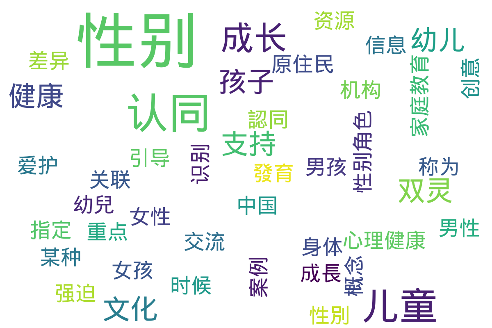

---
search:
  exclude: true
---

# 海外

!!! info

    该目录包含海外跨性别社群与非政府组织（NGO）的相关文件和信息，旨在介绍和记录这些社群如何支持跨性别人士及其所面临的挑战与机遇。

!!! note "📊 统计信息"

    总计内容：1 篇
    标签：`跨性别` `社群` `非政府组织` `海外` `支持与资源`

### 📄 文档

<table>
<thead><tr>
<th style="width: 40%" data-sortable="true" data-sort-direction="asc" data-sort-type="text">标题 ▲</th>
<th style="width: 15%" data-sortable="true" data-sort-direction="desc" data-sort-type="year">年份 ▼</th>
<th style="width: 45%">摘要</th>
</tr></thead>
<tbody>
<tr data-name="幼兒成長發育_性別認同" data-year="None" data-date="2024-11-02 02:42:23">
                <td><a href="幼兒成長發育_性別認同_page" class="md-button">幼兒成長發育_性別認同</a></td>
                <td class="year-cell">None</td>
                <td class="description-cell">

                    
展开

                    

                        本文件为关于幼儿成长与性别认同的讨论文档，重点探讨儿童在成长过程中如何认识和表达自己的性别认同。内容指出，儿童通常在2至3岁的时候开始识别到男性和女性身体之间的差异，并可能会将自己称为“男孩”或“女孩”。文中提到，通过具体的案例，阐述了指定性别与性别认同的关联，以及不同文化中性别认同的多样性，尤其强调了‘双灵’概念在原住民文化中的重要性。在文件中，提供了一些对于支持儿童健康性别发展的建议，如爱护和接受孩子的性别表达、避免强迫孩子适应某种性别角色以及引导健康的性别交流。文件还列出了许多支持跨性别及创意性别儿童的资源与机构信息。
                         年份：None
                         收录日期：2024-11-02 02:42:23
                    

                
</td>
            </tr>
</tbody>
</table>

## 📊 词云图 { data-search-exclude }

 

=== "最近更新"

    * 2025-1-10 [嗓音训练指南](../../手册指南/嗓音训练指南_page)
    * 2025-08-07 [高齡與性別—多元性別高齡照護與政策建議](../../../学术文献/人文社科/高齡與性別—多元性別高齡照護與政策建議_page)
    * 2025-08-07 [激素药物网络禁售后跨性别女性生活困境与照护需求的质性研究](../../../学术文献/医学/激素药物网络禁售后跨性别女性生活困境与照护需求的质性研究_page)
    * 2025-08-07 [跨性别态度与信念量表中文版测评成年人的效度和信度](../../../学术文献/医学/跨性别态度与信念量表中文版测评成年人的效度和信度_page)
    * 2025-08-07 [411女性向性别确认手术常问问题与回答](../../医院和医疗体系/411女性向性别确认手术常问问题与回答_page)
    * 2025-07-04 [信息补充——学历学位信息问题的一条解决路径](../中国大陆/信息补充——学历学位信息问题的一条解决路径_page)
    * 2025-06-20 [学历学位信息问题的一条解决路径_补充说明](../../手册指南/学历学位信息问题的一条解决路径_补充说明_page)
    * 2025-05-30 [不同立場定位之跨性別女性語言風格_言談及聲調分析](../../../学术文献/人文社科/不同立場定位之跨性別女性語言風格_言談及聲調分析_page)
    * 2025-05-30 [創傷孤島：臺灣跨性別者面臨之歧視、隱微歧視、創傷與韌性](../../../学术文献/人文社科/創傷孤島：臺灣跨性別者面臨之歧視、隱微歧視、創傷與韌性_page)
    * 2025-05-30 [Shattered_Memories_自切教程](../../手册指南/Shattered_Memories_自切教程_page)

!!! note "自动生成说明"
    目录及摘要为自动生成，仅供索引和参考，请修改 .github/ 目录下的对应脚本、模板或对应文件以更正。
